Q2:

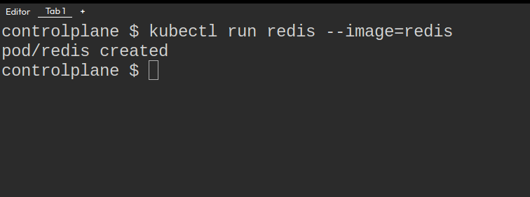{width="7.267716535433071in"
height="2.6944444444444446in"}

Q3:

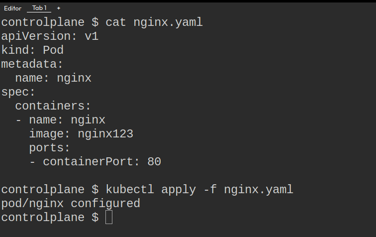{width="7.267716535433071in"
height="4.569444444444445in"}

Q4:

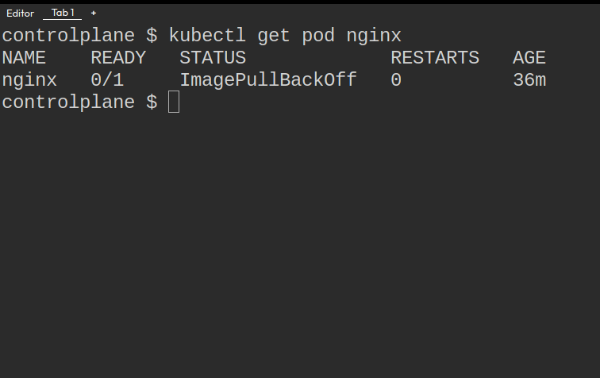{width="7.267716535433071in"
height="4.569444444444445in"}

Q5:

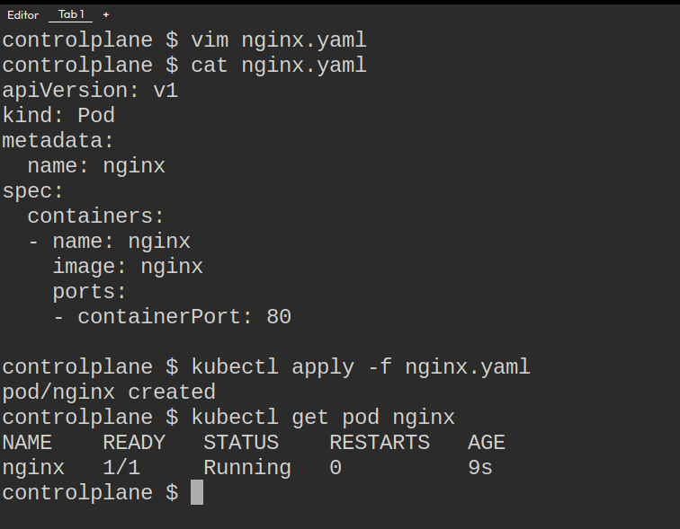{width="7.267716535433071in"
height="5.666666666666667in"}

Q6:

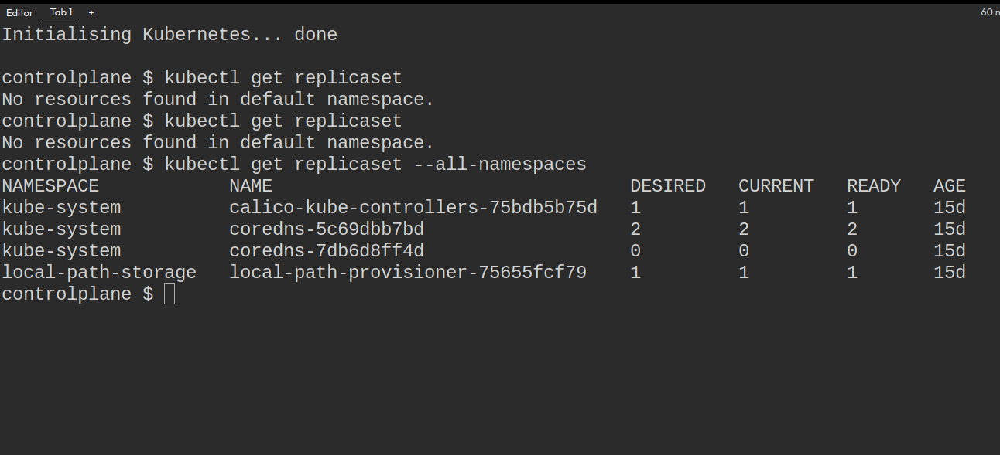{width="7.267716535433071in"
height="3.3194444444444446in"}

Q7:

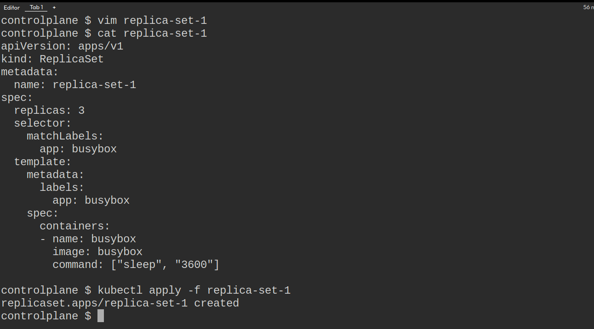{width="7.267716535433071in"
height="4.027777777777778in"}

Q8:

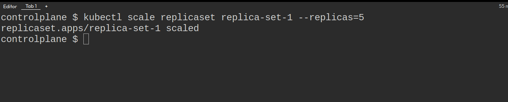{width="7.267716535433071in"
height="1.4722222222222223in"}

Q9:

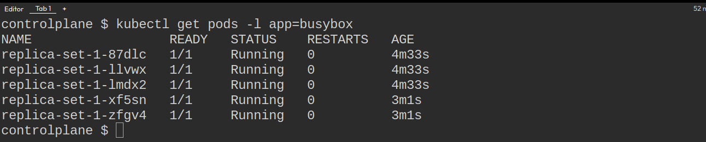{width="7.267716535433071in"
height="1.4722222222222223in"}

Q10:

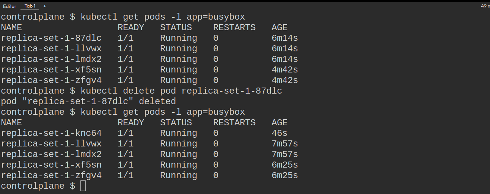{width="7.267716535433071in"
height="2.888888888888889in"}

You should still see 5 PODs. This happens because the ReplicaSet
controller ensures that the specified number of replicas are always
maintained. When a POD is deleted, the controller creates a new one to
maintain the desired state.

Q11:

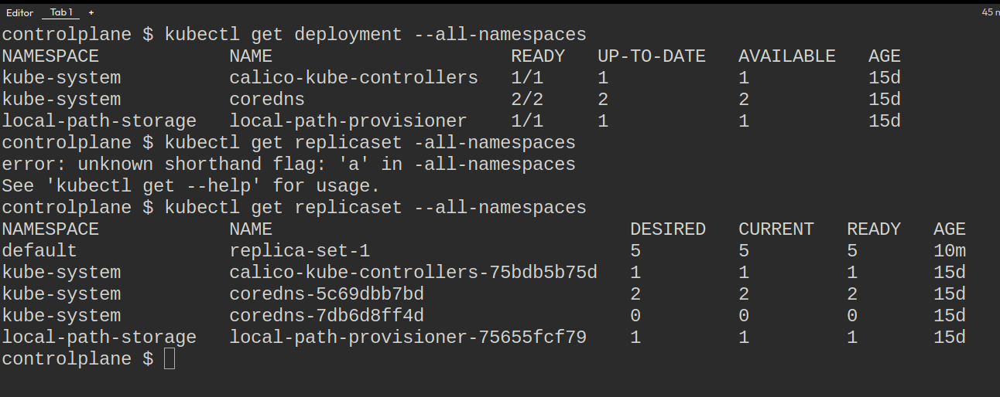{width="7.267716535433071in"
height="2.888888888888889in"}

Q12:

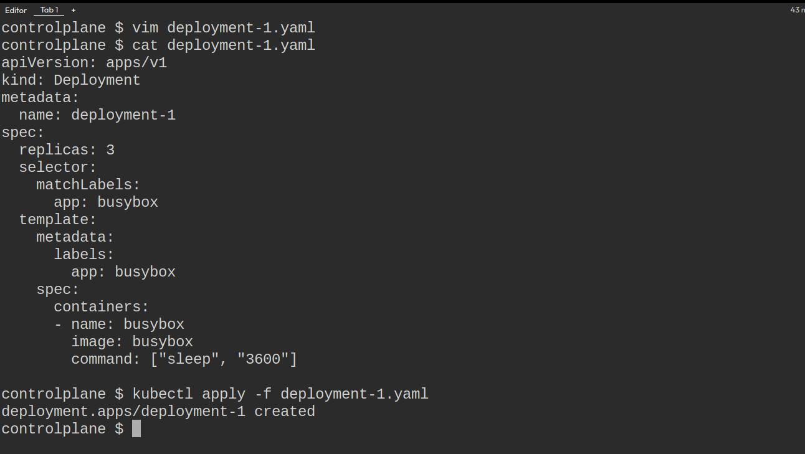{width="7.267716535433071in"
height="4.097222222222222in"}

Q13:

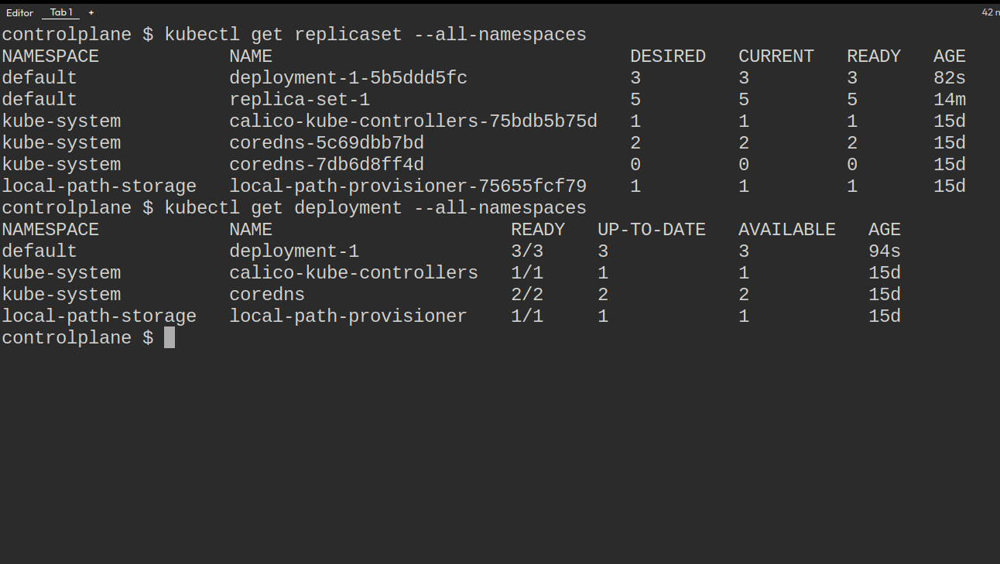{width="7.267716535433071in"
height="4.097222222222222in"}

Q14:

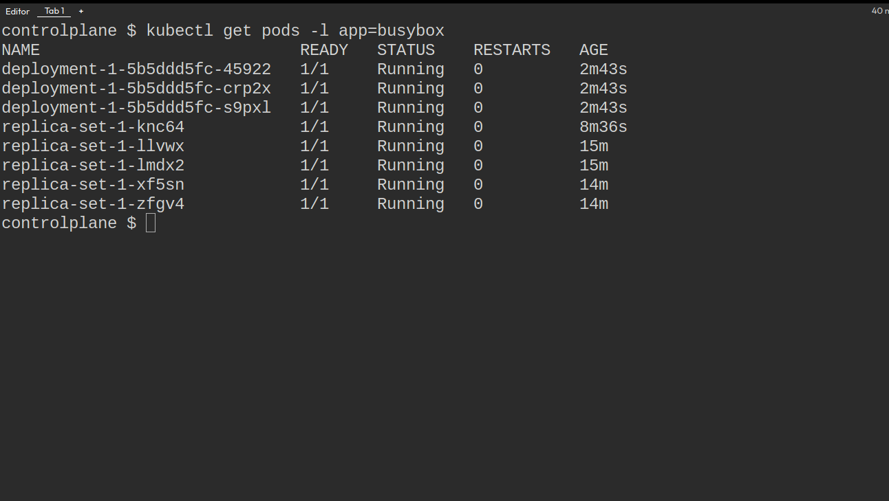{width="7.267716535433071in"
height="4.097222222222222in"}

Q15:

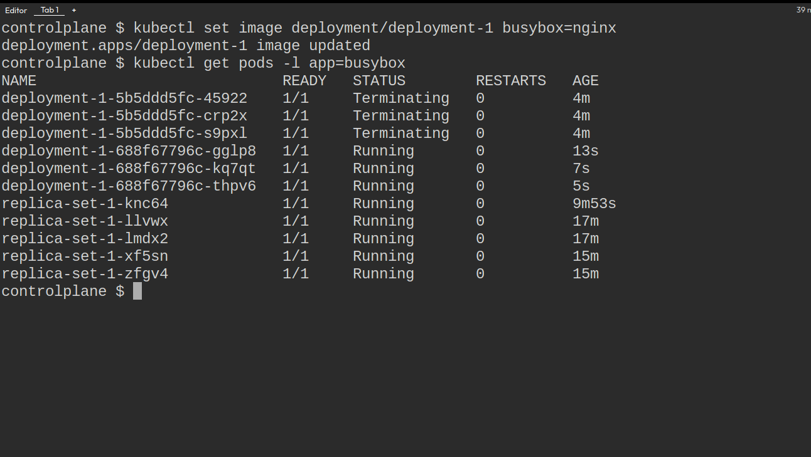{width="7.267716535433071in"
height="4.097222222222222in"}

Q16:

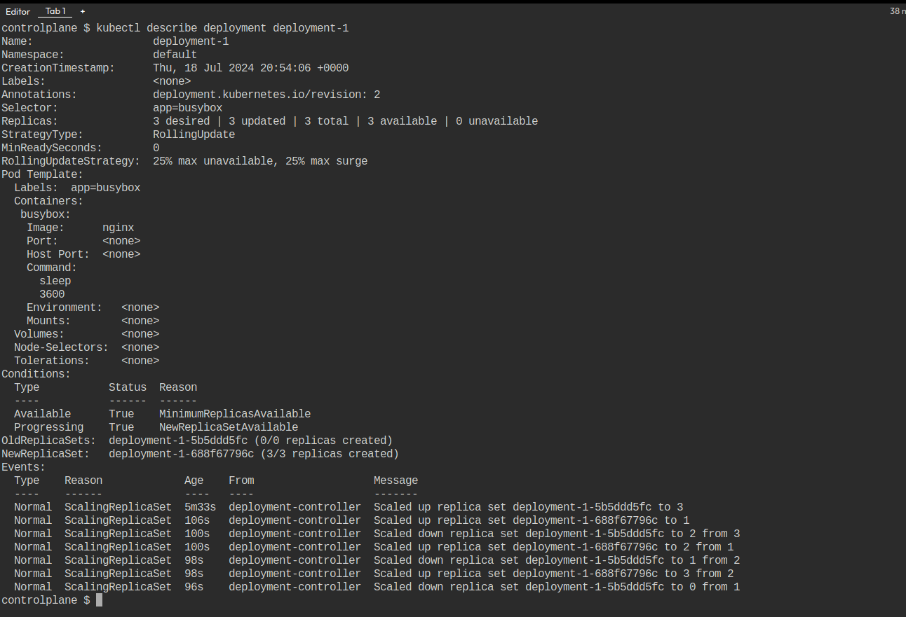{width="7.267716535433071in"
height="4.958333333333333in"}

Q17:

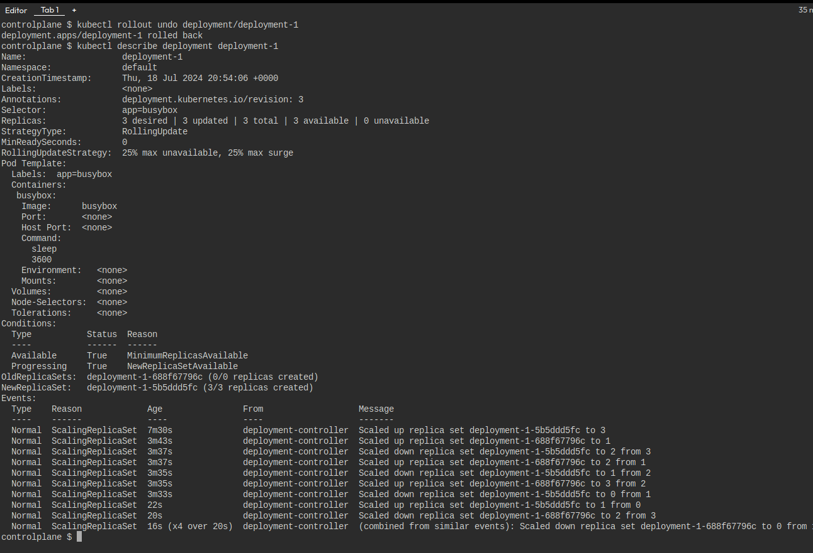{width="7.267716535433071in"
height="4.958333333333333in"}

Q18:

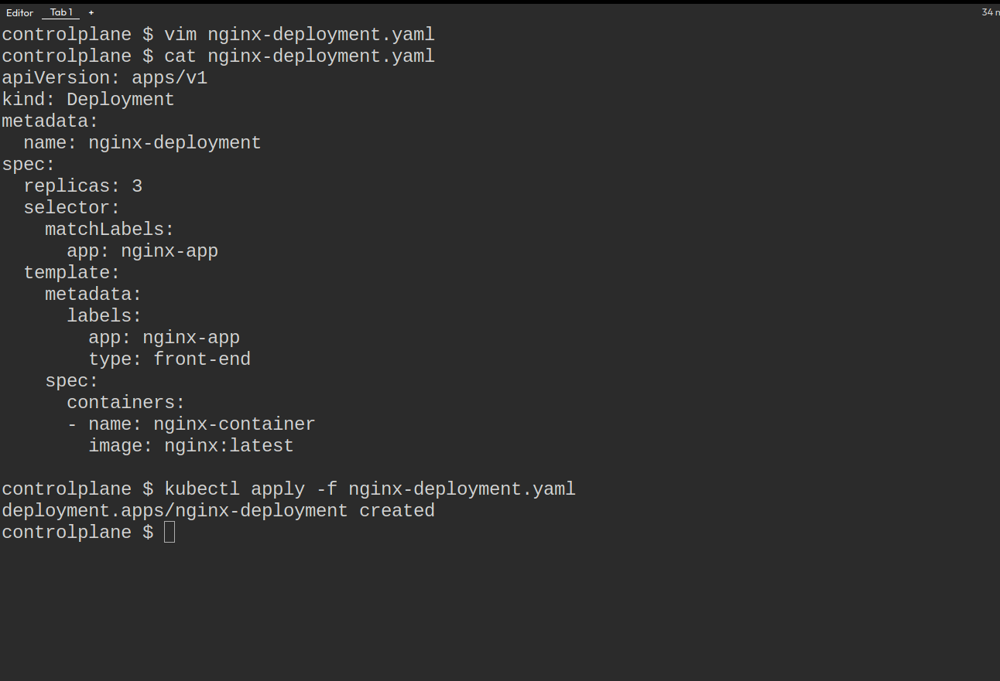{width="7.267716535433071in"
height="4.958333333333333in"}
